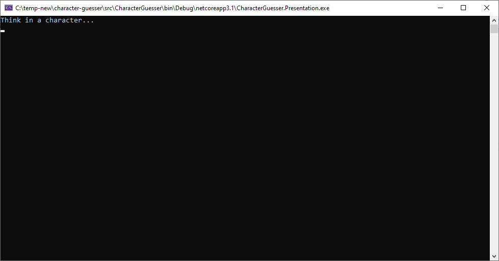
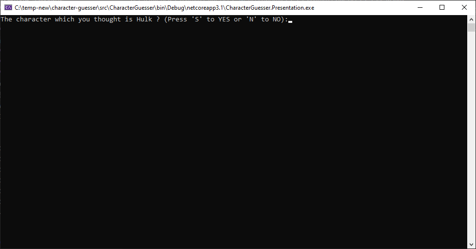
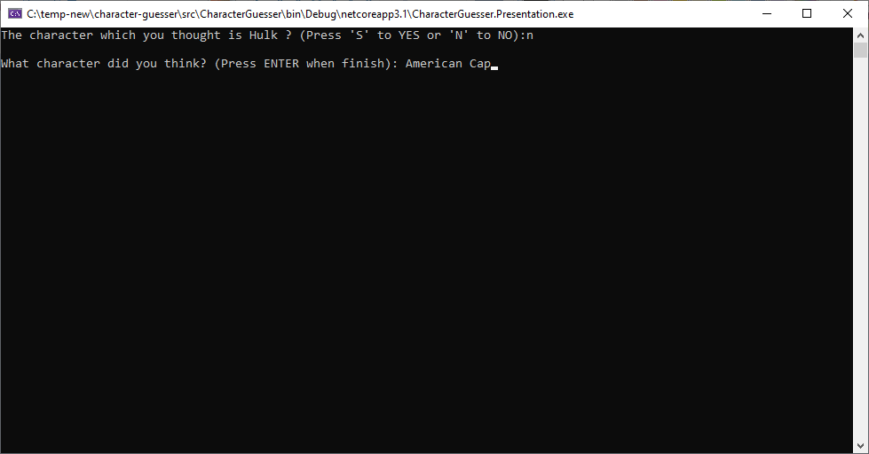

# Character Guesser

In this game, the application try guessing which character you thought. In negative case you can provide for it information to, on next time, it learns and do not make the same mistake.

## Download

There is an executable version [here](https://www.dropbox.com/s/lo5kpktraf5l66v/CharacterGuesser.zip?dl=1).

## To play

- Run *"CharacterGuesser.Presentation.exe"* application:

- Answear with 'S' to Yes and 'N' to No:

- In the end, the application will try guessing which character you thought:

- In case of wrong answear, it will ask you to teach it:

- And a feature that differs this character from others:

- Finally the game restarts.

## To build/modify

- Install .NET Core SDK 3.1
- Install Visual Studio 2019
- Open file "src/CharacterGuesser.sln"

## About

This game was based on [Akinator](https://en.akinator.com/) idea.